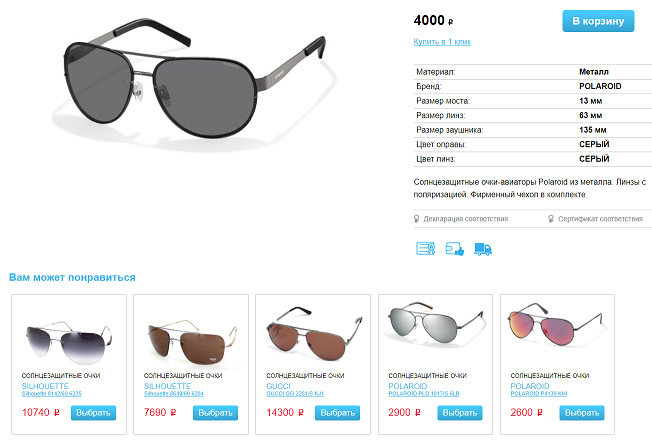
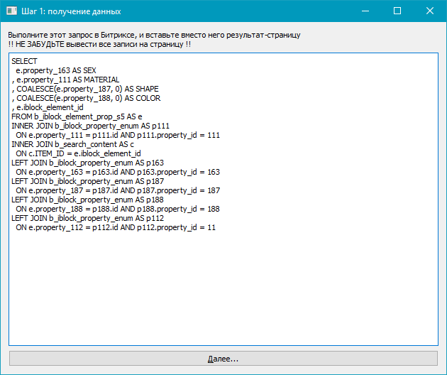
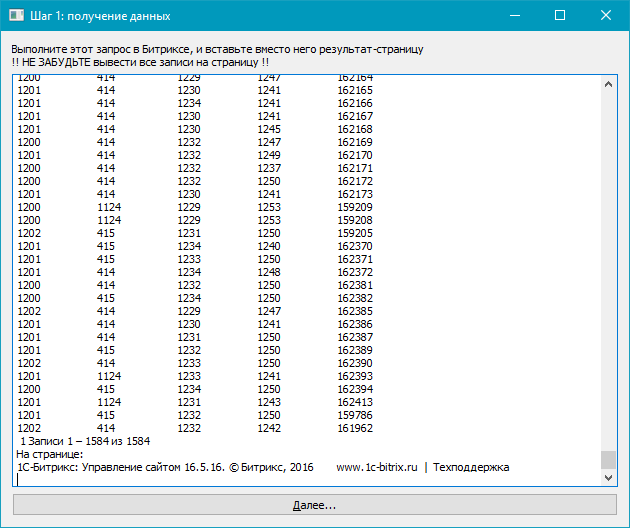
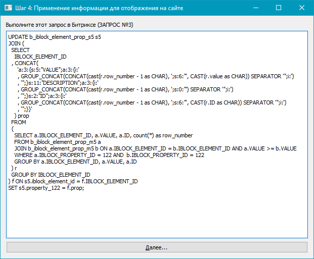

## Поиск похожих очков для магазина https://smartvision-optica.ru

#### Задача 
Реализовать автоматизированное заполнение раздела "Похожие товары" для интернет-магазина очков

По условию задачи "похожесть" определяется по четырем параметрам: пол, форма, цвет и материал. 
Каждый параметр имеет свой вес, который необходимо оставить как параметр для дальнейшего тюнинга.
Похожесть внутри параметра определяется таблицами. Например, для формы оправы таблица такая:

Форма|Авиаторы|Круглые|Овальные|Бабочки|Прямоугольные|Трапеция
-----|--------|-------|--------|-------|-------------|--------
Авиаторы|10|5|1|0|3|3
Круглые|5|10|9|3|0|0
Овальные|1|9|10|4|6|1
Бабочки|0|3|4|10|1|7
Прямоугольные|3|0|6|1|10|8
Трапеция|3|0|1|7|8|10

Сайт реализован на системе "Битрикс", поэтому необходимо было интегрроваться в нее. 
Проведя поверхностное исследование, было принято решение использовать полуавтоматическую 
интеграцию при помощи инструмента Битрикс "SQL запрос". Для такого рода интеграции
достаточно было создать мастера с минимальным пользовательским интерфейсом.

#### Технологии

Так как решение данной задачи связано с довольно ресурсоемкими вычислениями, для 
реализации был выбран язык **C++**. Развивая идеи оптимизации, и учитывая, что задача очень хорошо
параллелится, было принято решение вынести основные расчеты на **OpenCL**.

В качестве платформы для пользовательского интерфейса была выбрана библиотека **Qt**.

#### Реализация

Программа расчитана на опытного оператора Битрикс, в каком-то объеме знакомого с программированием.

Пользовательский интерфейс - это матсер из 4 шагов, с помощью которого оператор выполняет 
поставленную задачу:

